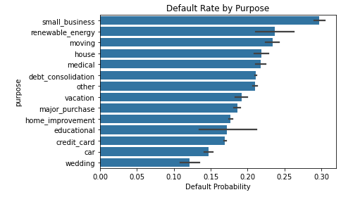
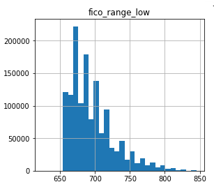
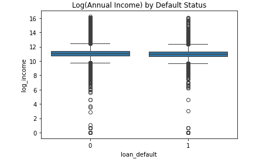
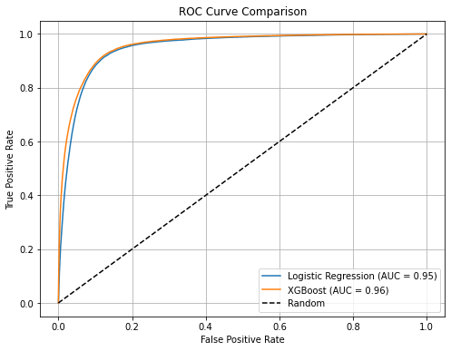
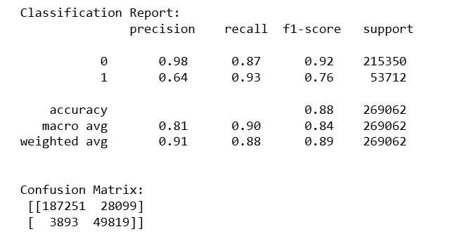
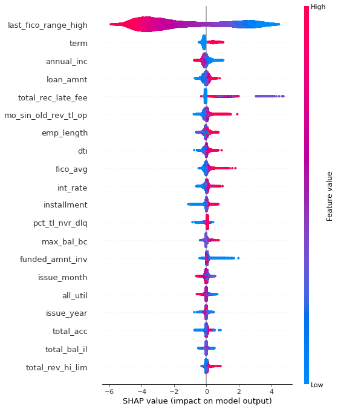
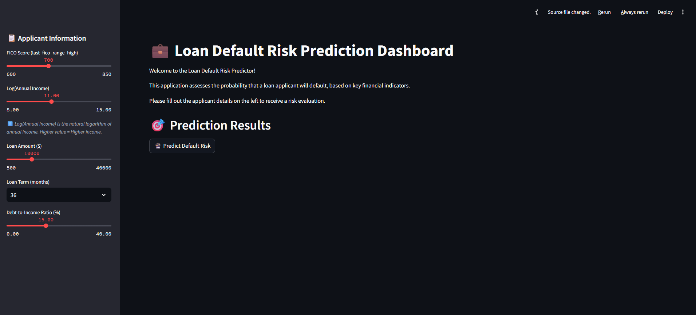
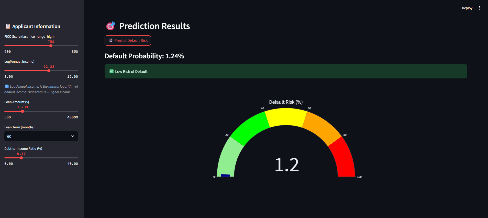

#  AI-Powered Credit Risk Classifier with Streamlit Dashboard

> End-to-End Credit Default Prediction System using Lending Club Loan Data (2007–2018)

---

##  Overview

This project builds a **credit risk classification pipeline** using over **1.34 million accepted Lending Club loan records** to predict whether a loan applicant is likely to default. It includes complete **ETL, modeling, SHAP explainability, and deployment** using a Streamlit dashboard.

---

##  Dataset

* **Source**: Lending Club (Accepted Loans 2007–2018)
* **Raw Size**: \~1.34M rows, 140+ columns
* **Files Used**: `accepted_2007_to_2018Q4.xlsx`, `rejected_2007_to_2018Q4.xlsx`
* **Source**: [Lending Club Loan Data (2007–2018) on Kaggle](https://www.kaggle.com/datasets/wordsforthewise/lending-club)

---

##  Technologies Used

* **Python (Pandas, NumPy, Scikit-learn, XGBoost)**
* **Streamlit** for model deployment
* **Matplotlib / Seaborn** for EDA
* **SHAP** for model interpretability
* **Jupyter Notebook**

---
##  Key Features & Pipeline

###  Data Cleaning & Engineering

* Cleaned 100+ features including `%`-based and date fields
* Engineered: `log_annual_income`, `fico_range_avg`, `term`, `dti`, `loan_default`
* Dropped data leakage features like `total_pymnt`, `recoveries`, etc.
* Final encoded feature set: **114 features**

---

### EDA & Risk Profiling

* Found **20% default rate**; identified **high-risk purposes** like small\_business (\~30%)
* Visualized income, FICO score, DTI across default groups

> **Image**:
> * Purpose-wise default rate:  

> * FICO score distribution:  

> * Log Annual Income by Default Status:  

---

### Modeling & Evaluation

* Split: **80% train / 20% test** (Stratified)
* Applied `scale_pos_weight` to manage class imbalance

#### Models Trained:

| Model               | ROC AUC  | Recall (1) | Precision (1) |
| ------------------- | -------- | ---------- | ------------- |
| Logistic Regression | 0.95     | 89%        | 62%           |
| **XGBoost** (final) | **0.96** | **92%**    | **66%**       |

> * ROC Curve: Logistic Regression vs XGBoost  

> * Confusion Matrix + Classification Report:  

---

### SHAP-Based Explainability

* Used **SHAP summary plot** to visualize feature impact
* Most impactful features:

  * `last_fico_range_high`
  * `term`
  * `log_annual_income`
  * `dti`, `total_rec_late_fee`

> * SHAP summary (top features impact):  

---

### Deployment: Streamlit Dashboard

Built a lightweight dashboard with:

* **5 features** (`fico`, `log_income`, `loan_amnt`, `term`, `dti`)
* Live classification using `xgboost_dashboard_model.pkl`
* Risk probability gauge and decision flag (threshold = 0.45)

> **Images**:
> * Dashboard UI:  

> * Prediction Outcome (Risk Gauge):  

---

##  Results

* **ROC-AUC Score**: 0.96 (XGBoost)
* **Recall (Defaults)**: 92%
* **Dashboard Model**: Fast, reliable, and interpretable with real-time scoring

---

## Skills Applied

* Machine Learning
* Data Engineering / Feature Engineering
* Model Explainability (SHAP)
* Streamlit App Deployment
* Financial Risk Modeling
---
